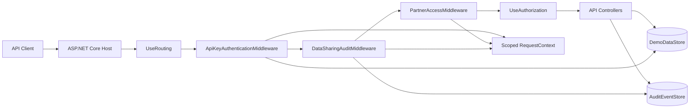
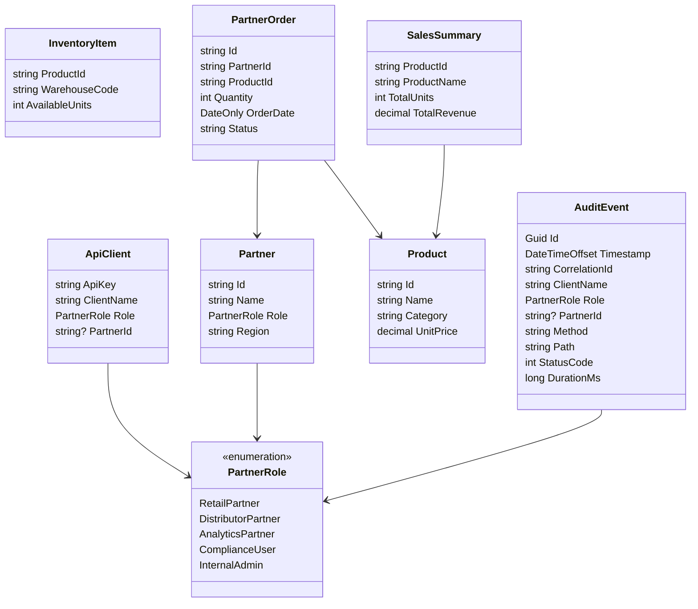

# Partner Data Sharing Middleware Demo Design

## Overview

This project is a fictional ASP.NET Core Web API used to demonstrate custom middleware for API-key authentication, partner data access control, and request auditing.

The system models a B2B partner data sharing platform with five client roles:

| Role | Purpose |
| --- | --- |
| RetailPartner | Reads products, inventory, and its own partner orders. |
| DistributorPartner | Reads products, inventory, and its own partner orders. |
| AnalyticsPartner | Reads aggregated sales summaries only. |
| ComplianceUser | Reads audit events only. |
| InternalAdmin | Can access partner, product, inventory, analytics, and compliance APIs. |

All data is stored in memory through singleton demo stores. The project is intended for middleware education, not production use.

## Goals

- Demonstrate a custom API-key authentication middleware.
- Demonstrate role-based and tenant-aware access enforcement without ASP.NET Core policy attributes.
- Demonstrate request auditing for protected API endpoints.
- Keep the sample easy to run with `dotnet run` and easy to validate with `dotnet test`.

## Non-Goals

- Persistent storage.
- Real identity provider integration.
- Production-grade API-key lifecycle management.
- Distributed tracing or external audit sinks.
- Full authorization policy framework.

## Runtime Architecture



The middleware order is important:

1. `ApiKeyAuthenticationMiddleware` creates the correlation id and authenticated client context.
2. `DataSharingAuditMiddleware` measures the protected request and records the final status code.
3. `PartnerAccessMiddleware` enforces role and tenant rules before controllers run.
4. Controllers execute only after authentication and access checks pass.

## Request Flow

```mermaid
sequenceDiagram
    participant C as Client
    participant A as ApiKeyAuthenticationMiddleware
    participant D as DataSharingAuditMiddleware
    participant P as PartnerAccessMiddleware
    participant R as Controller
    participant S as Store

    C->>A: HTTP request
    A->>A: Get or create X-Correlation-Id

    alt Public /health endpoint
        A->>D: Continue without API key
        D->>P: Continue
        P->>R: Continue
        R-->>C: 200 Healthy
    else Missing or invalid X-Api-Key
        A-->>C: 401 Unauthorized
    else Valid X-Api-Key
        A->>S: FindClient(apiKey)
        S-->>A: ApiClient
        A->>D: Continue with RequestContext
        D->>P: Continue and start timer
        P->>P: Evaluate role and partner boundary

        alt Access denied
            P-->>C: 400 or 403 response
            D->>S: Add audit event when endpoint is auditable
        else Access allowed
            P->>R: Continue
            R->>S: Read or mutate demo data
            R-->>C: API response
            D->>S: Add audit event when endpoint is auditable
        end
    end
```



## Components

| Component | Lifetime | Responsibility |
| --- | --- | --- |
| `ApiKeyAuthenticationMiddleware` | Middleware | Validates `X-Api-Key`, creates `RequestContext.Client`, and returns `401` for missing or invalid keys. |
| `DataSharingAuditMiddleware` | Middleware | Records audit events for protected API endpoint access while suppressing audit-log reads. |
| `PartnerAccessMiddleware` | Middleware | Enforces endpoint role permissions and partner tenant isolation. |
| `RequestContext` | Scoped | Carries correlation id, authenticated client, role, and partner id for the current request. |
| `DemoDataStore` | Singleton | Holds API clients, partners, products, inventory, orders, and sales summaries in memory. |
| `AuditEventStore` | Singleton | Holds audit events in memory and returns them newest first. |

## Endpoint Design

| Endpoint | Method | Access |
| --- | --- | --- |
| `/health` | `GET` | Public. No API key required. |
| `/api/products` | `GET` | RetailPartner, DistributorPartner, InternalAdmin. |
| `/api/inventory` | `GET` | RetailPartner, DistributorPartner, InternalAdmin. |
| `/api/partners/{partnerId}/orders` | `GET` | RetailPartner or DistributorPartner for own partner id; InternalAdmin for any partner. |
| `/api/partners/{partnerId}/orders` | `POST` | RetailPartner or DistributorPartner for own partner id; InternalAdmin for any partner. |
| `/api/analytics/sales-summary` | `GET` | AnalyticsPartner, InternalAdmin. |
| `/api/compliance/audit-events` | `GET` | ComplianceUser, InternalAdmin. |

## Access Control Matrix

All protected endpoints require a valid API key before access rules are evaluated.

| Area | Allowed roles | Extra rule | Failure |
| --- | --- | --- | --- |
| Products and inventory | RetailPartner, DistributorPartner, InternalAdmin | None | `403 Forbidden` |
| Partner orders | RetailPartner, DistributorPartner, InternalAdmin | Partners can access only their own `partnerId`; InternalAdmin can access any partner. Missing partner context returns `400 Bad Request`. | `403 Forbidden` or `400 Bad Request` |
| Analytics | AnalyticsPartner, InternalAdmin | None | `403 Forbidden` |
| Compliance audit events | ComplianceUser, InternalAdmin | None | `403 Forbidden` |

Requests that do not match a protected rule continue through the normal ASP.NET Core pipeline.

## Domain Model



## Authentication Design

Clients authenticate with the `X-Api-Key` header. The middleware compares the provided key against the in-memory `DemoDataStore.ApiClients` collection.

On every request, including public endpoints, the middleware also handles `X-Correlation-Id`:

- If the request includes `X-Correlation-Id`, the same value is used.
- If it is missing, a new GUID-based value is generated.
- The selected value is written to the response header and `RequestContext`.

Public endpoint bypass:

- `/health` does not require an API key.
- All other endpoints require a valid API key.

## Authorization Design

Authorization is centralized in `PartnerAccessMiddleware` and based on the request path plus the authenticated `ApiClient.Role`.

Partner order access is tenant-aware:

- The requested partner id comes from the route value `{partnerId}` or `X-Partner-Id`.
- Retail and distributor clients can access only the partner id assigned to their API client.
- `InternalAdmin` can access any partner id.
- Missing partner context returns `400`.
- Cross-partner access returns `403`.

## Auditing Design

The audit middleware records authenticated requests for protected API endpoints:

- `/api/products`
- `/api/inventory`
- `/api/partners`
- `/api/analytics`
- Other future `/api/...` endpoints

Audit events are written after downstream middleware/controllers complete, so the stored event includes the final HTTP status code and elapsed duration.

Reads of `/api/compliance/audit-events` are intentionally not audited. This prevents the audit log from appending a new "read audit log" event every time a compliance user inspects the audit log.

Audit event fields include:

- Event id.
- UTC timestamp.
- Correlation id.
- Client name.
- Role.
- Partner id, when available.
- HTTP method.
- Request path.
- Response status code.
- Duration in milliseconds.

## Data Storage

The demo uses in-memory singleton stores:

- `DemoDataStore` contains static clients, partners, products, inventory, and mutable orders.
- `AuditEventStore` contains mutable audit events.

Both mutable collections use locks around reads and writes. Data resets when the process restarts.

## Testing Strategy

The test project uses `WebApplicationFactory<Program>` to run the API in memory and validate middleware behavior through real HTTP calls.

Covered cases include:

- `/health` works without an API key and returns a correlation id.
- Protected endpoints reject missing and invalid API keys.
- Retail partners can read their own orders but cannot read another partner's orders.
- Distributor partners can create and view their own orders.
- Analytics partners can read aggregated summaries but cannot read partner orders.
- Compliance users can read audit events, including a prior request correlation id.

## Operational Notes

Run the API:

```powershell
dotnet run --project PartnerDataSharing.Api
```

Run tests:

```powershell
dotnet test
```

OpenAPI is available in Development at:

```text
/openapi/v1.json
```

## Production Hardening Considerations

Before adapting this pattern to a production system:

- Store API keys as hashed secrets, not plain text.
- Move client, partner, order, and audit data to durable storage.
- Use ASP.NET Core authentication and authorization handlers for policy-driven enforcement.
- Add rate limiting and key rotation.
- Send audit events to an append-only store or external logging pipeline.
- Add structured logging around denied requests and audit persistence failures.
- Add validation for request payloads using a consistent validation strategy.
